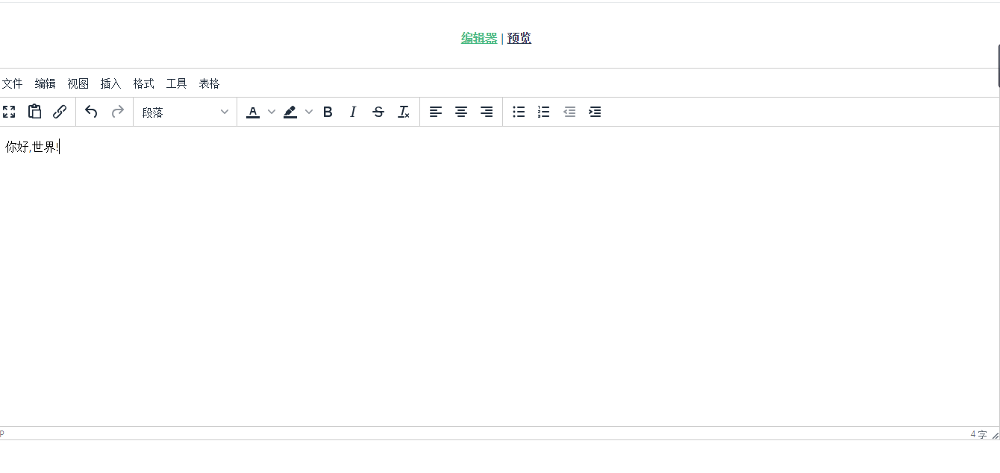
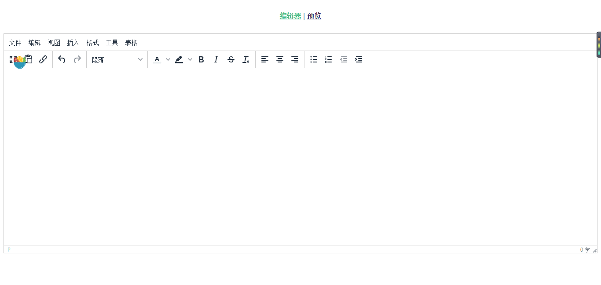
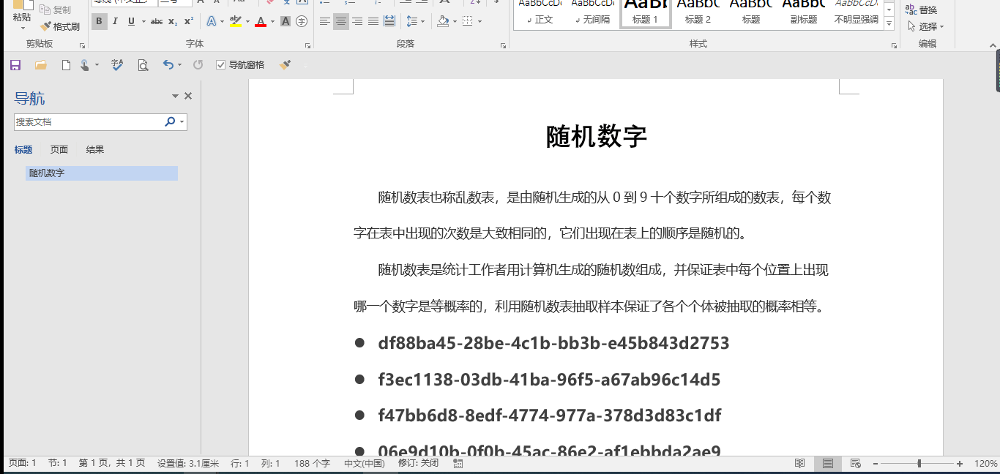
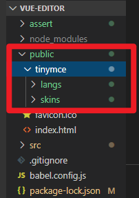
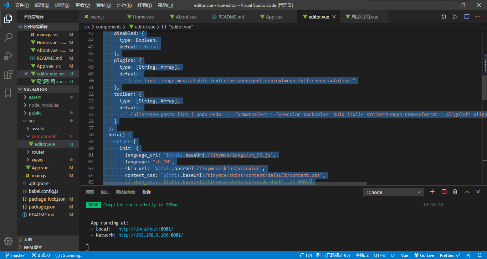

# vue-tinymce-editor 使用教程

> 2020 年 3 月 20 日更新
>
> 湖北 ● 武汉


> vue 编辑器 inymce,款符合现代审美的富文本编辑器



# 前言

最近忙于前端页面的开发,想找一款符合现代审美的编辑器,于是我选择了这一款--tinymce-editor

# 特点

- 支持表格编辑
- word|135 编辑器|网页 复制内容可保留大部分样式
- 支持代码块

# 中文文档:

> 1.https://liubing.me/vue-tinymce-5.html#L4
>
> 2.http://tinymce.ax-z.cn/plugins/noneditable.php

# 效果

## 文本编辑



## 粘贴 word



## 粘贴网页|| 编辑器内容


# 预览

## 安装依赖

```
npm install
```

## 运行测试

```
npm run serve
```

# 使用

## 安装 tinymce-vue

```
npm install @tinymce/tinymce-vue -S

```

## 下载 tinymce

```
npm install tinymce -S

```

复制当前项目这两个文件到你的项目`public目录下`，然后使用



## 组件封装

如图：复制这个项目下的 `src\components\editor.vue`



## 全局使用组件

在 mian.js 里面

```js
// 全局使用编辑器
import TinymceEditor from "./components/editor.vue";
Vue.component("tinymce-editor", TinymceEditor);
```

## 局部使用组件

参照`src\views\局部引用.vue`文件

```js
<script>
import TinymceEditor from './tinymce-editor/tinymce-editor'
export default {
  components: {
    TinymceEditor
  },
  data () {
    return {
      msg: 'Welcome to Use Tinymce Editor',
      disabled: false
    }
  },
  methods: {
      .....
```

## 编辑器工具栏配置

此处请参照

这里主要是在`src\components\editor.vue` 进行配置`plugins`和`toolbar`

```js
tinymce.init({
  selector: "#tinydemo",
  plugins: "noneditable"
});
```

参考配置

```js
plugins: 'lists image media table wordcount',
toolbar: 'undo redo |  formatselect | bold italic forecolor backcolor | alignleft aligncenter alignright alignjustify | bullist numlist outdent indent | lists image media table | removeformat'
```

更多插件使用请参照http://tinymce.ax-z.cn/plugins/noneditable.php

# 支持

> 如果觉得这篇文章帮到你，请给个 star 或请我一杯咖啡 😋


